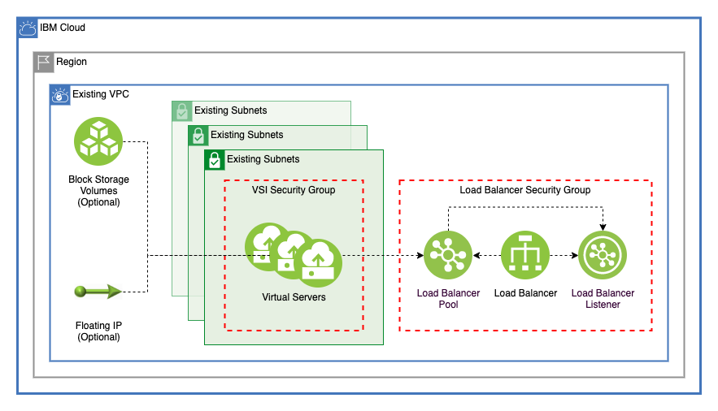

# Virtual Server on VPC With Load Balancer

This module allows a user to create identical Virtual Servers across any number of subnets in a single VPC. Optionally, the user can add additional Block Storage volumes and Floating IPs to the Virtual Servers. The virtual servers are then added to an application Load Balancer.



---

## Table of Contents

1. [Virtual Servers](##Virtual-Servers)
    - [Security-Group](###Security-Group)
    - [SSH Key](###ssh-key)
    - [User Data](###user-data)
    - [Block Storage Volumes](###Block-Storage-Volumes)
    - [Floating IP](###floating-ip)
2. [Application Load Balancer](##Application-Load-Balancer)
    - [Load Balancer Security Group](###load-balancer-security-group)
    - [Load Balancer Pool](###load-balancer-pool)
    - [Load Balancer Listener](###load-balancer-listener)
3. [Module Variables](##module-vairables)
4. [Module Outputs](##module-outputs)
5. [As A Module in a Larger Architecture](##As-A-Module-in-a-Larger-Architecture)

---

## Virtual Servers

This module creates Virtual servers across any number of subnets in a single VPC connected by a single security group. As an example, a [config script](./config/ubuntu_install_nginx.sh) is used to install NGINX onto them. Users can specify how many virtual servers to provision on each subnet by using the `vsi_per_subnet` variable. Virtual servers use the subnet name and the prefix to dynamically create names. These names are also used as the terraform address for each Virtual Server, allowing for easy reference:

```terraform
module.virtual_servers.ibm_is_instance.vsi["jv-vsi-dev-subnet-a-gcat-vsi-1"]
module.virtual_servers.ibm_is_instance.vsi["jv-vsi-dev-subnet-a-gcat-vsi-2"]
module.virtual_servers.ibm_is_instance.vsi["jv-vsi-dev-subnet-b-gcat-vsi-1"]
module.virtual_servers.ibm_is_instance.vsi["jv-vsi-dev-subnet-b-gcat-vsi-2"]
module.virtual_servers.ibm_is_instance.vsi["jv-vsi-dev-subnet-c-gcat-vsi-1"]
module.virtual_servers.ibm_is_instance.vsi["jv-vsi-dev-subnet-c-gcat-vsi-2"]
```

### Security Group

This module creates a security group where all the Virtual Servers will be attached. Rules can be added in the `security_group_rules` variable. By default, a rule to allow all inbound traffic and a rule to allow all outbound traffic are created. Security group rules can be added, changed, and removed from this list without unwanted changes, since the addresses are stored by rule name:

```terraform
module.virtual_servers.ibm_is_security_group_rule.vsi_security_group_rules["allow-all-inbound"]
module.virtual_servers.ibm_is_security_group_rule.vsi_security_group_rules["allow-all-outbound"]
```

### SSH Key

Users can either specify the name of an existing SSH Key with the `existing_ssh_key_name` or create a new SSH Key by adding an SSH Public key to the `ssh_public_key` variable. Using the `ssh_public_key` variable will override using `existing_ssh_key_name`.

### User Data

A post provision script can be proivided to the virtual servers from inside this directory. By changing the `user_data_file_path`, a user can change where inside this module the post provision script exists. To specify a path outside of this directory, change the following line in [main.tf](main.tf)

```terraform
user_data            = var.user_data_file_path == null ? null : file("${path.module}/${var.user_data_file_path}")
```

### Block Storage Volumes

This module allows users to create any number of identical block storage volumes. One of each storage volume specified in the `volumes` variable will be created and attached to each virtual server. These block storage volumes use the Virtual Server name and the volume name to create easily identifiable and manageble addressess within terraform:

```terraform
module.virtual_servers.ibm_is_volume.volume["jv-vsi-dev-subnet-a-gcat-vsi-1-one"]
module.virtual_servers.ibm_is_volume.volume["jv-vsi-dev-subnet-a-gcat-vsi-1-three"]
module.virtual_servers.ibm_is_volume.volume["jv-vsi-dev-subnet-a-gcat-vsi-1-two"]
module.virtual_servers.ibm_is_volume.volume["jv-vsi-dev-subnet-a-gcat-vsi-2-one"]
module.virtual_servers.ibm_is_volume.volume["jv-vsi-dev-subnet-a-gcat-vsi-2-three"]
module.virtual_servers.ibm_is_volume.volume["jv-vsi-dev-subnet-a-gcat-vsi-2-two"]
module.virtual_servers.ibm_is_volume.volume["jv-vsi-dev-subnet-b-gcat-vsi-1-one"]
module.virtual_servers.ibm_is_volume.volume["jv-vsi-dev-subnet-b-gcat-vsi-1-three"]
module.virtual_servers.ibm_is_volume.volume["jv-vsi-dev-subnet-b-gcat-vsi-1-two"]
module.virtual_servers.ibm_is_volume.volume["jv-vsi-dev-subnet-b-gcat-vsi-2-one"]
module.virtual_servers.ibm_is_volume.volume["jv-vsi-dev-subnet-b-gcat-vsi-2-three"]
module.virtual_servers.ibm_is_volume.volume["jv-vsi-dev-subnet-b-gcat-vsi-2-two"]
module.virtual_servers.ibm_is_volume.volume["jv-vsi-dev-subnet-c-gcat-vsi-1-one"]
module.virtual_servers.ibm_is_volume.volume["jv-vsi-dev-subnet-c-gcat-vsi-1-three"]
module.virtual_servers.ibm_is_volume.volume["jv-vsi-dev-subnet-c-gcat-vsi-1-two"]
module.virtual_servers.ibm_is_volume.volume["jv-vsi-dev-subnet-c-gcat-vsi-2-one"]
module.virtual_servers.ibm_is_volume.volume["jv-vsi-dev-subnet-c-gcat-vsi-2-three"]
module.virtual_servers.ibm_is_volume.volume["jv-vsi-dev-subnet-c-gcat-vsi-2-two"]
```

### Floating IP

By using the `enable_floating_ip` a floating IP will be assigned to each VSI created by this module. This floating IP will be displayed in the output if provisioned.

---

## Application Load Balancer

The [load balancer module](./load_balancer) creates an Application Load Balancer that distributes traffic between each Virtual Server. This Load Balancer is attached to each subnet where Virtual Servers are provisioned.

### Load Balancer Security Group

This security group regulates traffic to and from the Load Balancer and creates rules in the same way as the [Virtual Server Security Group](###security-group). In [main.tf](./main.tf), security group rules are dynamically created to allow inbound and outbount traffic from each subnet where VSI are created.

```terraform
  subnet_security_group_rules = flatten([
    for subnet in local.subnets: 
    [
      {
        name      = "allow-inbound-${subnet.name}"
        remote    = subnet.cidr
        direction = "inbound"
      },
      {
        name      = "allow-outbound-${subnet.name}"
        remote    = subnet.cidr
        direction = "outbound"
      }
    ]
  ])
```

### Load Balancer Pool

This module creates a back end load balancer pool. Each Virtual server is added to the Load Balancer Pool.

### Load Balancer Listener

Once the members have been added to the Load Balancer Pool, a listener is created for the bacl end pool.

---

## Module Variables

Name                     | Type                                                                                                                                                                                                                                                                                                                            | Description                                                                                                              | Sensitive | Default
------------------------ | ------------------------------------------------------------------------------------------------------------------------------------------------------------------------------------------------------------------------------------------------------------------------------------------------------------------------------- | ------------------------------------------------------------------------------------------------------------------------ | --------- | -------------------------------------------------------------------------------------------------------------------------------------------------------------------------------------------------------------------------------------------------
ibmcloud_api_key         | string                                                                                                                                                                                                                                                                                                                          | The IBM Cloud platform API key needed to deploy IAM enabled resources                                                    | true      | 
TF_VERSION               | string                                                                                                                                                                                                                                                                                                                          | The version of the Terraform engine that's used in the Schematics workspace.                                             |           | 1.0
prefix                   | string                                                                                                                                                                                                                                                                                                                          | A unique identifier need to provision resources. Must begin with a letter                                                |           | gcat-vsi
region                   | string                                                                                                                                                                                                                                                                                                                          | Region where VPC will be created                                                                                         |           | us-south
resource_group           | string                                                                                                                                                                                                                                                                                                                          | Name of resource group where all infrastructure will be provisioned                                                      |           | asset-development
vpc_name                 | string                                                                                                                                                                                                                                                                                                                          | The name of the VPC where VSI will be provisioned                                                                        |           | 
subnet_names             | list(string)                                                                                                                                                                                                                                                                                                                    | The name of subnets on the VPC where the virtual servers will be created                                                 |           | 
image                    | string                                                                                                                                                                                                                                                                                                                          | Image name used for VSI. Run 'ibmcloud is images' to find available images in a region                                   |           | ibm-ubuntu-18-04-1-minimal-amd64-1
ssh_public_key           | string                                                                                                                                                                                                                                                                                                                          | SSH Public Key to create when creating virtual server instances. Using this value will override `existing_ssh_key_name`. | true      | null
existing_ssh_key_name    | string                                                                                                                                                                                                                                                                                                                          | Import an existing SSH key by name. Using `ssh_public_key` will override this value                                      |           | null
machine_type             | string                                                                                                                                                                                                                                                                                                                          | VSI machine type. Run 'ibmcloud is instance-profiles' to get a list of regional profiles                                 |           | bx2-2x8
vsi_per_subnet           | number                                                                                                                                                                                                                                                                                                                          | Number of VSI instances for each subnet                                                                                  |           | 2
user_data_file_path      | string                                                                                                                                                                                                                                                                                                                          | Path to a post provision script for virtual servers. Change to `null` to not use a post provision script                 |           | /config/ubuntu_install_nginx.sh
enable_floating_ip       | bool                                                                                                                                                                                                                                                                                                                            | Create a floating IP for each virtual server created                                                                     |           | true
volumes                  | list( object({ name = string profile = string capacity = optional(number) }) )                                                                                                                                                                                                                                                  | A list of volumes to be added to each virtual server instance                                                            |           | [<br>{<br>name = "one"<br>profile = "10iops-tier"<br>capacity = 25<br>},<br>{<br>name = "two"<br>profile = "10iops-tier"<br>}<br>]
security_group_rules     | list( object({ name = string direction = string remote = string tcp = optional( object({ port_max = optional(number) port_min = optional(number) }) ) udp = optional( object({ port_max = optional(number) port_min = optional(number) }) ) icmp = optional( object({ type = optional(number) code = optional(number) }) ) }) ) | A list of security group rules to be added to the VSI security group                                                     |           | [<br>{<br>name = "allow-all-outbound"<br>direction = "outbound"<br>remote = "0.0.0.0/0"<br>},<br>{<br>name = "allow-all-inbound"<br>direction = "inbound"<br>remote = "0.0.0.0/0"<br>}<br>]
use_public_load_balancer | bool                                                                                                                                                                                                                                                                                                                            | Use public load balancer. If false, a private one will be created                                                        |           | true
pool                     | object({ algorithm = string protocol = string pool_member_port = number health_delay = number health_retries = number health_timeout = number health_type = string })                                                                                                                                                           | Load balancer pool to be created                                                                                         |           | {<br>algorithm = "round_robin"<br>protocol = "http"<br>health_delay = 15<br>health_retries = 10<br>health_timeout = 10<br>health_type = "http"<br>pool_member_port = 80<br>}
listener                 | object({ port = number protocol = string })                                                                                                                                                                                                                                                                                     | Load balancer listener                                                                                                   |           | {<br>port = 80<br>protocol = "http"<br>}
lb_security_group_rules  | list( object({ name = string direction = string remote = string tcp = optional( object({ port_max = optional(number) port_min = optional(number) }) ) udp = optional( object({ port_max = optional(number) port_min = optional(number) }) ) icmp = optional( object({ type = optional(number) code = optional(number) }) ) }) ) | A list of security group rules to be added to the Load Balancer security group                                           |           | [<br>{<br>name = "allow-inbound-port-80"<br>direction = "inbound"<br>remote = "0.0.0.0/0"<br>tcp = {<br>port_min = 80<br>port_max = 80<br>}<br>},<br>{<br>name = "allow-all-outbound"<br>direction = "outbound"<br>remote = "0.0.0.0/0"<br>}<br>]

---

## Module Outputs

Name          | Description                                                 | Value
------------- | ----------------------------------------------------------- | ------------------------------------
vsi_ids       | The IDs of the VSI                                          | module.virtual_servers.ids
vsi_by_subnet | A list of virtual servers by subnet                         | module.virtual_servers.vsi_by_subnet
vsi_list      | A list of VSI with name, id, zone, and primary ipv4 address | module.virtual_servers.list
lb_hostname   | Hostname for the Load Balancer created                      | module.load_balancer.hostname

---

## As a Module in a Larger Architecture

Be sure to remove the `provider` block from [main.tf](main.tf) when using this module in another architecture

```terraform
module virtual_servers {
  source                   = "./virtual_servers"
  prefix                   = var.prefix
  region                   = var.region
  resource_group           = var.resource_group
  vpc_name                 = var.vpc_name
  subnet_names             = var.subnet_names
  image                    = var.image
  ssh_public_key           = var.ssh_public_key
  existing_ssh_key_name    = var.existing_ssh_key_name
  machine_type             = var.machine_type
  vsi_per_subnet           = var.vsi_per_subnet
  user_data_file_path      = var.user_data_file_path
  enable_floating_ip       = var.enable_floating_ip
  volumes                  = var.volumes
  security_group_rules     = var.security_group_rules
  use_public_load_balancer = var.use_public_load_balancer
  pool                     = var.pool
  listener                 = var.listener
  lb_security_group_rules  = var.lb_security_group_rules
}
```
